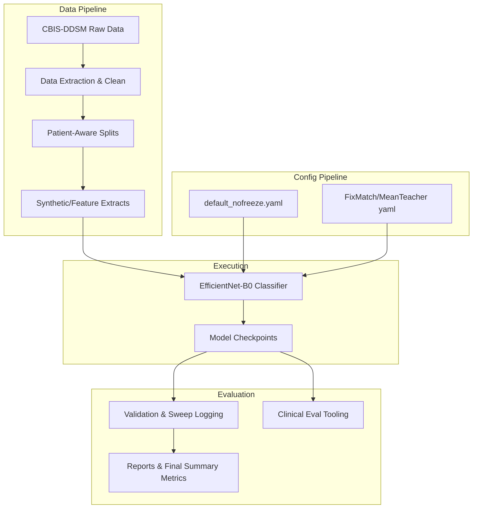
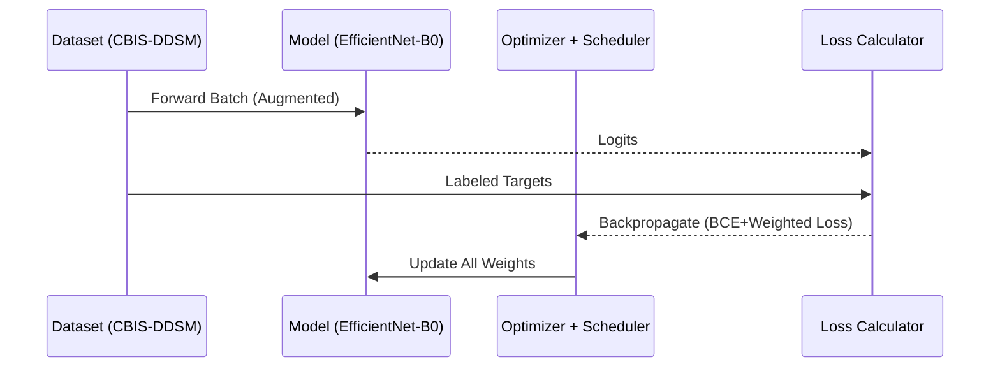

# 1. Introduction & Motivation

Breast cancer screening relies heavily on mammography. Deep learning holds promise for automated decision support, but large-scale annotated datasets are rare and expensive to curate. Semi-Supervised Learning (SSL) was hypothesized to efficiently leverage unlabeled data. 

This research project started as a **Supervised vs. Semi-Supervised** comparative study. Over the course of the project, it became apparent that fixing weaknesses in the baseline supervised pipeline (specifically avoiding overly restrictive backbone freezing) unlocked performance that outmatched the targeted SSL baselines (FixMatch and Mean Teacher) within the constraints of the CBIS-DDSM dataset distribution. 

> **Note**: This repository and document belong to an academic master's research project and are intended for review and educational purposes.

# 2. High-Level Architecture

The system standardizes data handling, preprocessing, and metrics logging to ensure fair comparisons across both supervised and semi-supervised techniques.



# 3. Workflows & Training Pipelines

The final architecture converges on two primary historical mechanisms evaluated simultaneously with the promoted baseline. 

## 3.1. Promoted Baseline: No-Freeze Supervised
The official path forwards completely eschews the SSL mechanisms, substituting them with better augmentation, optimization (`AdamW`), and regularization (`label_smoothing`), allowing gradients to immediately tune the pretrained backbone representations.



## 3.2. Historical Alternative: FixMatch
FixMatch was the primary SSL candidate. It uses weakly-augmented unlabeled images to generate confident pseudo-labels, which are then used as targets for strongly-augmented versions of the same images.

```mermaid
flowchart LR
    L_Batch[Labeled Batch]
    U_Batch[Unlabeled Batch]
    
    subgraph Weak Augmentation
        U_Batch --> U_Weak[Weakly Augmented]
        U_Weak --> M1[Model]
        M1 --> PL[Pseudo Labels >= 0.95 Threshold]
    end
    
    subgraph Strong Augmentation
        U_Batch --> U_Strong[(RandAugment) Strongly Augmented]
        U_Strong --> M2[Model]
        M2 --> P[Predictions]
    end
    
    L_Batch --> M3[Model]
    M3 --> L_Pred[Supervised Predictions]
    
    PL --> UnsupLoss[Consistency / Unsupervised Loss]
    P --> UnsupLoss
    
    L_Pred --> SupLoss[Supervised Loss]
    
    SupLoss --> TotalLoss
    UnsupLoss --> TotalLoss
```

# 4. Results & Findings

### Phase 1: Closing The Vanilla SSL Chapter

Grouped mean validation AUC on the initial baseline comparisons:

| Method | 100 labels | 250 labels | 500 labels |
|--------|------------|------------|------------|
| Supervised (frozen historical baseline) | 0.6033 | 0.7097 | 0.8084 |
| **Supervised no-freeze (official baseline)** | **0.7442** | **0.8370** | **0.8575** |
| FixMatch | 0.6559 | 0.6788 | - |
| Mean Teacher | 0.6325 | 0.6595 | 0.6861 |

**Conclusion:** The original supervised baseline was artificially constrained by backbone freezing behavior. Once corrected, direct supervised fine-tuning clearly outperformed the vanilla SSL methods explored in this environment.

### Phase 2: Refined Decision-Support Promoted Pipeline

Sweeping over resolution, architecture, regularization, and optimizers yielded the following final pipeline specs for operational evaluation:
- `EfficientNet-B0` Architecture
- `512x512` Image Resolution
- `label_smoothing = 0.1`
- Optimizer: `AdamW`

**6-Seed Clinical-Style Evaluation (`seed 42-47`):**

| Performance Metric | Mean Assessment Outcome |
|--------|-------|
| Test ROC AUC | `0.7589` |
| Test PR AUC | `0.6748` |
| Sensitivity | `0.7110` |
| Specificity | `0.6651` |
| Specificity @ 0.90 Sensitivity | `0.5833` |
| Exam-level ROC AUC | `0.7668` |

# 5. Appendix & Setup Reference

## A. Environment Setup
To reproduce or utilize the codebase, the following setup is utilized locally:

```bash
python -m venv .venv
source .venv/bin/activate
pip install -r requirements.txt
pip install -e ".[dev]"
```

## B. Recommended Invocation
To train the primary accepted model config on 500 labeled instances:
```bash
python scripts/train_supervised.py \
  --config configs/default_nofreeze_ls_adamw.yaml \
  --labeled_subset 500 \
  --output_dir results/default_nofreeze_ls_adamw_500_seed42 \
  --seed 42
```

Followed immediately by clinical evaluation:
```bash
python scripts/clinical_eval.py \
  --run_dir results/default_nofreeze_ls_adamw_500_seed42 \
  --output_dir results/default_nofreeze_ls_adamw_500_seed42/clinical_eval
```
